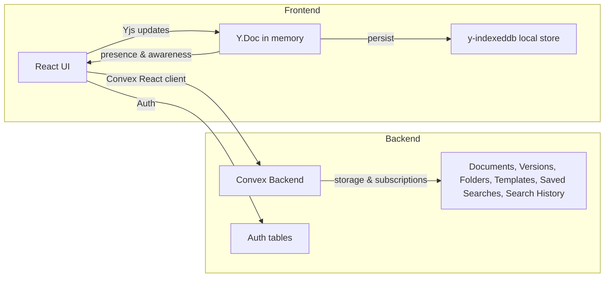

# Architecture Overview

Purpose
- Lightweight summary of AuraWrite’s core architecture for fast onboarding and consistent decision-making.

Sources
- See [PROJECT_DESCRIPTION.md](.kilocode/rules/memory-bank/PROJECT_DESCRIPTION.md)
- See [TECH_STACK.md](.kilocode/rules/memory-bank/TECH_STACK.md)
- See [README.md](README.md)
- See [src/ui/App.tsx](src/ui/App.tsx)
- See [convex/schema.ts](convex/schema.ts)

Surfaces
- Web app: Vite + React 19 single-page application.
- Desktop app: Electron 37 bundling the same React app, with TypeScript main and preload processes.

High-level System
- Frontend (React + Tailwind + Radix UI) renders dashboard, editor, and UI primitives.
- Editor built on Slate with real-time collaboration via Yjs CRDT.
- Offline-first via y-indexeddb local persistence of Y.Doc state; sync resumes when online.
- Backend via Convex (queries, mutations, actions, subscriptions) for storage and realtime.
- Auth via @convex-dev/auth with @auth/core (password flow).
- Error handling uses React error boundaries for queries, explicit try/catch for mutations/actions.

Mermaid Overview

Frontend Application Shell
- Auth states: unauthenticated, loading, authenticated gating the app shell (see [src/ui/App.tsx](src/ui/App.tsx)).
- Error boundaries wrap app areas to surface query errors cleanly.
- Dashboard surface for browsing/organizing content and opening documents.
- Editor surface uses Slate + Yjs bindings; autosave and sync are implicit through CRDT updates.

Editor and Collaboration
- Slate provides rich text primitives; Slate–Yjs bindings connect operations to Y.Doc.
- Yjs maintains the authoritative CRDT document in client memory and emits updates.
- y-indexeddb persists Y.Doc locally for offline continuity and fast cold start.
- Presence indicators driven by collaboration session data and awareness signals.
- Sync performance monitoring available in UI for transparency and diagnostics.

Backend and Data
- Convex hosts typed queries, mutations, actions, and subscriptions for real-time updates.
- Schema includes documents, documentVersions, collaborationSessions, folders, templates, savedSearches, searchHistory (see [convex/schema.ts](convex/schema.ts)).
- Search indexes power fast lookups, such as search_title on documents.

Auth
- Password-based flow implemented via @convex-dev/auth and @auth/core.
- App shell uses Authenticated, Unauthenticated, AuthLoading layout guards.
- Auth and data permissions enforced server-side via Convex functions.

Offline-first Behavior
- Y.Doc changes accumulate locally and are persisted to IndexedDB via y-indexeddb.
- When connectivity is restored, Yjs syncs vector clocks with peers/server and merges changes.
- Convex subscriptions deliver server-side changes; CRDT resolves conflicts deterministically.

Build and Dev
- npm run dev launches Vite, Electron, and Convex dev server concurrently.
- npm run build compiles TypeScript and bundles the SPA for production and Electron packaging.

Error Handling Summary
- Queries: surfacing via error boundaries at render time.
- Mutations: explicit try/catch with user feedback and optional optimistic updates.
- Actions: explicit try/catch; consider manual retry policies.
- See policy details in [ERROR_HANDLING_POLICY.md](.kilocode/rules/memory-bank/ERROR_HANDLING_POLICY.md).