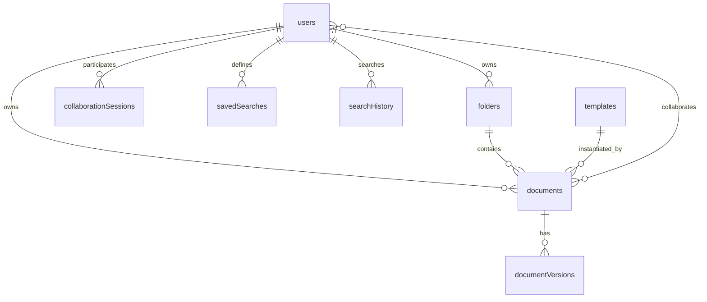

# Data Model

## Purpose
- Lightweight, high-level overview of Convex tables and key indexes to guide feature work and queries.
 
## Scope
- Covers logical entities, relationships, and primary indexes only. For full schema, see [convex/schema.ts](convex/schema.ts).
 
## Sources
- [convex/schema.ts](convex/schema.ts)
- [.kilocode/rules/memory-bank/TECH_STACK.md](.kilocode/rules/memory-bank/TECH_STACK.md)
- [.kilocode/rules/memory-bank/ARCHITECTURE_OVERVIEW.md](.kilocode/rules/memory-bank/ARCHITECTURE_OVERVIEW.md)

## Mermaid Overview

## Auth Tables
- Included via Convex authTables and not detailed here. Enforce user identity and permission references.

## Documents

Purpose
- Primary content entity for collaborative documents.

Key fields
- title: string
- content: optional string (DEPRECATED — legacy Slate JSON)
- contentFormat: optional enum ("slate" | "yjs")  # See Notes for canonical format guidance
- yjsState: optional bytes (Y.Doc binary, PREFERRED canonical document state)
- yjsStateVector: optional bytes (sync optimization)
- ownerId: id users
- isPublic: optional boolean
- collaborators: optional array of id users
- createdAt: number
- updatedAt: number
- yjsUpdatedAt: optional number
- tags: optional string[]
- status: optional enum draft published archived
- folderId: optional id folders
- templateId: optional id templates
- lastAccessedAt: optional number
- isFavorite: optional boolean

Indexes
- by_owner: ownerId
- by_updated: updatedAt
- by_folder: folderId
- by_folder_owner: folderId, ownerId
- by_status: status
- by_owner_status: ownerId, status
- by_favorite: ownerId, isFavorite
- by_last_accessed: lastAccessedAt
- by_template: templateId
- by_public: isPublic
- by_owner_favorite_updated: ownerId, isFavorite, updatedAt
- search_title: search on title; supports filtering by ownerId, isPublic, status, and folderId

Notes
- Canonical source-of-truth: yjsState (Y.Doc binary) is the canonical runtime state for collaborative documents. Prefer reading/writing from/to yjsState for real-time sync and authoritative merges.
- Legacy content: content stores Slate JSON snapshots from older flow and is now considered deprecated. content may be present for historical/backfill reasons; avoid writing new content into this field.
- contentFormat field (optional) indicates which format a document snapshot primarily uses. When present:
  - "yjs" => yjsState is authoritative; treat content as legacy.
  - "slate" => content is authoritative (legacy-only use-case); prefer backfilling to yjsState when possible.
- Reads/writes guidance:
  - Reads: prefer yjsState. If yjsState is missing, fall back to content only for read-only rendering or migration flows.
  - Writes: always update yjsState (and yjsStateVector when applicable). Do not write to content for new edits.
  - DocumentVersions still store Slate JSON snapshots (content) for immutable history; Version creation should derive Slate JSON from the Y.Doc when possible (see migration guidance).
- Migration / Backfill guidance (concise):
  1. Goal: ensure every active document has a valid yjsState representing the latest content and mark content as deprecated.
  2. Strategy:
     - For documents with yjsState present: leave as-is; optionally generate a Slate JSON snapshot and store in DocumentVersions if version history is required.
     - For documents with only content (Slate JSON):
       a. Create a temporary Y.Doc and apply a conversion that loads Slate JSON into the Yjs-aware Slate structure (examples below).
       b. Serialize the Y.Doc to binary and write to yjsState; set contentFormat = "yjs".
       c. Optionally record a DocumentVersion with the original Slate JSON.
  3. Backfill performance notes:
     - Batch conversions during off-peak hours.
     - Throttle writes to Convex to avoid rate limits; use pagination over documents (e.g., by updatedAt).
     - Mark progress (e.g., in a separate backfill table or logs) to allow safe retries.
- Simple conversion example (conceptual):
  - Slate JSON -> Y.Doc (Node/Script):
    1. const Y = require('yjs')
    2. const { applySlateToYjs } = require('./conversion-utils') // project helper
    3. const ydoc = new Y.Doc()
    4. const slateJson = /* load from document.content */
    5. applySlateToYjs(ydoc, slateJson) // convert and populate Y.Doc
    6. const ybuf = Y.encodeStateAsUpdate(ydoc)
    7. write ybuf to document.yjsState and set contentFormat = "yjs"
  - Y.Doc -> Slate JSON (for DocumentVersions or export):
    1. const ydoc = new Y.Doc()
    2. Y.applyUpdate(ydoc, ybuf) // ybuf from document.yjsState
    3. const slateJson = convertYjsToSlate(ydoc)
    4. store slateJson in documentVersions.content or export
- Which field to prefer:
  - Runtime reads/writes: yjsState (preferred)
  - Historical snapshots / immutable versions: DocumentVersions.content (Slate JSON)
  - Legacy-only reads: content (use only when yjsState absent)
- Additional references:
  - See convex/yjsSync.ts for sync utilities and helpers that show how Yjs state is applied and serialized within the codebase.
  - If you need a robust conversion helper, add a conversion utility under src/utils/ that implements applySlateToYjs and convertYjsToSlate; include tests for round-trip fidelity.

## DocumentVersions
 
Purpose
- Immutable version snapshots for history and potential rollback.
 
Key fields
- documentId: id documents
- content: string (Slate JSON)
- version: number
- createdBy: id users
- createdAt: number
- yjsSnapshot: optional bytes (canonical Y.Doc binary snapshot for exact restore)
- yjsProtocolVersion: optional number (Yjs/protocol schema version for the snapshot)
 
Indexes
- by_document: documentId
- by_document_version: documentId, version
 
Notes
- Version is a monotonically increasing sequence per document.
- Uniqueness: (documentId, version) must be unique. The storage layer (Convex) doesn't enforce uniqueness automatically, so write paths creating versions MUST enforce uniqueness at write time. Recommended write logic:
  1. Read the latest version for documentId to compute nextVersion.
  2. Attempt to insert a version record with nextVersion.
  3. If a conflict/duplicate is detected (another writer created the same version in parallel), re-query the latest version and retry with an incremented version number. Repeat a bounded number of times (e.g., 5) before failing.
  4. Alternatively, an idempotent upsert policy can be used when the client can provide a deterministic version number; otherwise prefer the retry approach to avoid silent overwrites.
- Yjs snapshot & protocol version:
  - Store the canonical Y.Doc binary in yjsSnapshot to allow exact restoration of runtime state when rolling back to a version.
  - Store a yjsProtocolVersion number (or schemaVersion) alongside the snapshot so restore logic can validate compatibility before applying the snapshot to a runtime Y.Doc.
  - On restore/rollback, verify the stored yjsProtocolVersion matches the server's supported protocol/version. If incompatible, reject the restore or run a migration path that upgrades the snapshot before applying.
- Write/restore guidance:
  - When creating a DocumentVersion from a Y.Doc, persist both the Slate JSON content (for historical snapshots and diffing) and the canonical Y.Doc snapshot (yjsSnapshot) plus the yjsProtocolVersion.
  - When restoring a version, load yjsSnapshot, validate yjsProtocolVersion, and apply the binary update to a fresh Y.Doc to ensure the runtime state exactly matches the saved version.
  - Keep yjsSnapshot optional for legacy versions that only contain Slate JSON. Favor creating versions that include the snapshot going forward.

## CollaborationSessions

Purpose
- Presence, cursors, and selections for live collaboration.

Key fields
- documentId: id documents
- userId: id users
- cursor: optional object with anchor path[] offset and focus path[] offset
- selection: optional object with anchor path[] offset and focus path[] offset
- lastSeen: number

Indexes
- by_document: documentId
- by_user_document: userId, documentId
- by_document_last_seen: documentId, lastSeen
- by_document_user: documentId, userId

Notes
- Optimized for presence lists and active collaborator UI, ordered by recency.

## Folders

Purpose
- Hierarchical organization of documents.

Key fields
- name: string
- color: optional string
- parentId: optional id folders
- ownerId: id users
- createdAt: number
- updatedAt: number

Indexes
- by_owner: ownerId
- by_parent: parentId
- by_owner_parent: ownerId, parentId
- by_owner_parent_name: ownerId, parentId, name
 
Notes
- Supports nested folder trees via parentId.
- Recommend enforcing unique `name` among siblings (ownerId + parentId) in write paths using the by_owner_parent_name index.

## Templates

Purpose
- Reusable document blueprints.

Key fields
- name: string
- description: optional string
- content: string (Slate JSON)
- category: string
- isTeamTemplate: boolean
- createdBy: id users
- createdAt: number
- updatedAt: number

Indexes
- by_creator: createdBy
- by_creator_updated: createdBy, updatedAt
- by_category: category
- by_team_template: isTeamTemplate
- search_templates: search on name with filters category isTeamTemplate createdBy

Notes
- Enables category browsing and search by name.

## SavedSearches

Purpose
- User-defined persisted searches and filters.

Key fields
- name: string
- query: optional string
- filters: object
  - folderId: optional id folders
  - status: optional enum draft published archived
  - tags: optional string[]
  - dateRange: optional object start number end number
- sortBy: optional enum title updatedAt createdAt lastAccessedAt
- sortOrder: optional enum asc desc
- userId: id users
- createdAt: number
- updatedAt: number

Indexes
- by_user: userId
- by_user_created: userId, createdAt
- by_user_name: userId, name
 
Notes
- Drives dashboard sidebar and quick access lists.
- Recommend enforcing unique (userId, name) in write paths using the by_user_name index.

## SearchHistory

Purpose
- Recent queries for autocomplete and analytics.

Key fields
- query: string
- userId: id users
- searchedAt: number
- resultCount: optional number

Indexes
- by_user: userId
- by_user_searched: userId, searchedAt
- by_searchedAt: searchedAt
- by_query: query

Notes
- Supports personalized suggestions and cleanup policies.

Conventions
- Timestamps are epoch milliseconds (ms since UNIX epoch). Prefer server-generated timestamps to avoid client clock skew.
- Optional fields indicate feature-driven sparseness.
- All foreign keys reference Convex id types for referential integrity.