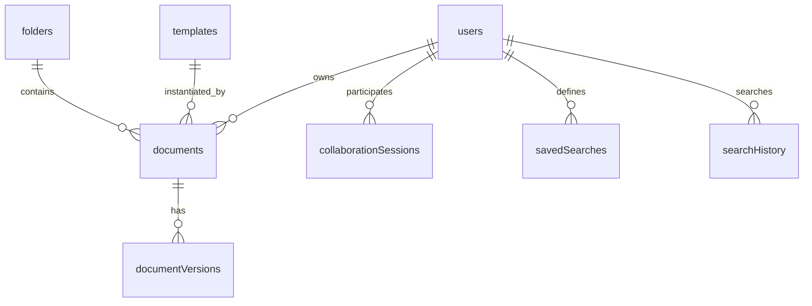

# Data Model

Purpose
- Lightweight, high-level overview of Convex tables and key indexes to guide feature work and queries.

Scope
- Covers logical entities, relationships, and primary indexes only. For full schema, see [convex/schema.ts](convex/schema.ts).

Sources
- [convex/schema.ts](convex/schema.ts)
- [.kilocode/rules/memory-bank/TECH_STACK.md](.kilocode/rules/memory-bank/TECH_STACK.md)
- [.kilocode/rules/memory-bank/ARCHITECTURE_OVERVIEW.md](.kilocode/rules/memory-bank/ARCHITECTURE_OVERVIEW.md)

Mermaid Overview

Auth Tables
- Included via Convex authTables and not detailed here. Enforce user identity and permission references.

## Documents

Purpose
- Primary content entity for collaborative documents.

Key fields
- title: string
- content: optional string (legacy Slate JSON)
- yjsState: optional bytes (Y.Doc binary)
- yjsStateVector: optional bytes (sync optimization)
- ownerId: id users
- isPublic: optional boolean
- collaborators: optional array of id users
- createdAt: number
- updatedAt: number
- yjsUpdatedAt: optional number
- tags: optional string[]
- status: optional enum draft published archived
- folderId: optional id folders
- templateId: optional id templates
- lastAccessedAt: optional number
- isFavorite: optional boolean

Indexes
- by_owner: ownerId
- by_updated: updatedAt
- by_folder: folderId
- by_folder_owner: folderId, ownerId
- by_status: status
- by_owner_status: ownerId, status
- by_favorite: ownerId, isFavorite
- by_last_accessed: lastAccessedAt
- search_title: search on title with filters ownerId isPublic status folderId

Notes
- yjsState and yjsStateVector support real-time CRDT sync.
- search_title powers fast title lookup and filtered search.

## DocumentVersions

Purpose
- Immutable version snapshots for history and potential rollback.

Key fields
- documentId: id documents
- content: string (Slate JSON)
- version: number
- createdBy: id users
- createdAt: number

Indexes
- by_document: documentId
- by_document_version: documentId, version

Notes
- Version is a monotonically increasing sequence per document.

## CollaborationSessions

Purpose
- Presence, cursors, and selections for live collaboration.

Key fields
- documentId: id documents
- userId: id users
- cursor: optional object with anchor path[] offset and focus path[] offset
- selection: optional object with anchor path[] offset and focus path[] offset
- lastSeen: number

Indexes
- by_document: documentId
- by_user_document: userId, documentId
- by_document_last_seen: documentId, lastSeen

Notes
- Optimized for presence lists and active collaborator UI, ordered by recency.

## Folders

Purpose
- Hierarchical organization of documents.

Key fields
- name: string
- color: optional string
- parentId: optional id folders
- ownerId: id users
- createdAt: number
- updatedAt: number

Indexes
- by_owner: ownerId
- by_parent: parentId
- by_owner_parent: ownerId, parentId

Notes
- Supports nested folder trees via parentId.

## Templates

Purpose
- Reusable document blueprints.

Key fields
- name: string
- description: optional string
- content: string (Slate JSON)
- category: string
- isTeamTemplate: boolean
- createdBy: id users
- createdAt: number
- updatedAt: number

Indexes
- by_creator: createdBy
- by_category: category
- by_team_template: isTeamTemplate
- search_templates: search on name with filters category isTeamTemplate createdBy

Notes
- Enables category browsing and search by name.

## SavedSearches

Purpose
- User-defined persisted searches and filters.

Key fields
- name: string
- query: optional string
- filters: object
  - folderId: optional id folders
  - status: optional enum draft published archived
  - tags: optional string[]
  - dateRange: optional object start number end number
- sortBy: optional enum title updatedAt createdAt lastAccessedAt
- sortOrder: optional enum asc desc
- userId: id users
- createdAt: number
- updatedAt: number

Indexes
- by_user: userId
- by_user_created: userId, createdAt

Notes
- Drives dashboard sidebar and quick access lists.

## SearchHistory

Purpose
- Recent queries for autocomplete and analytics.

Key fields
- query: string
- userId: id users
- searchedAt: number
- resultCount: optional number

Indexes
- by_user: userId
- by_user_searched: userId, searchedAt
- by_searchedAt: searchedAt
- by_query: query

Notes
- Supports personalized suggestions and cleanup policies.

Conventions
- Timestamps are epoch numbers.
- Optional fields indicate feature-driven sparseness.
- All foreign keys reference Convex id types for referential integrity.